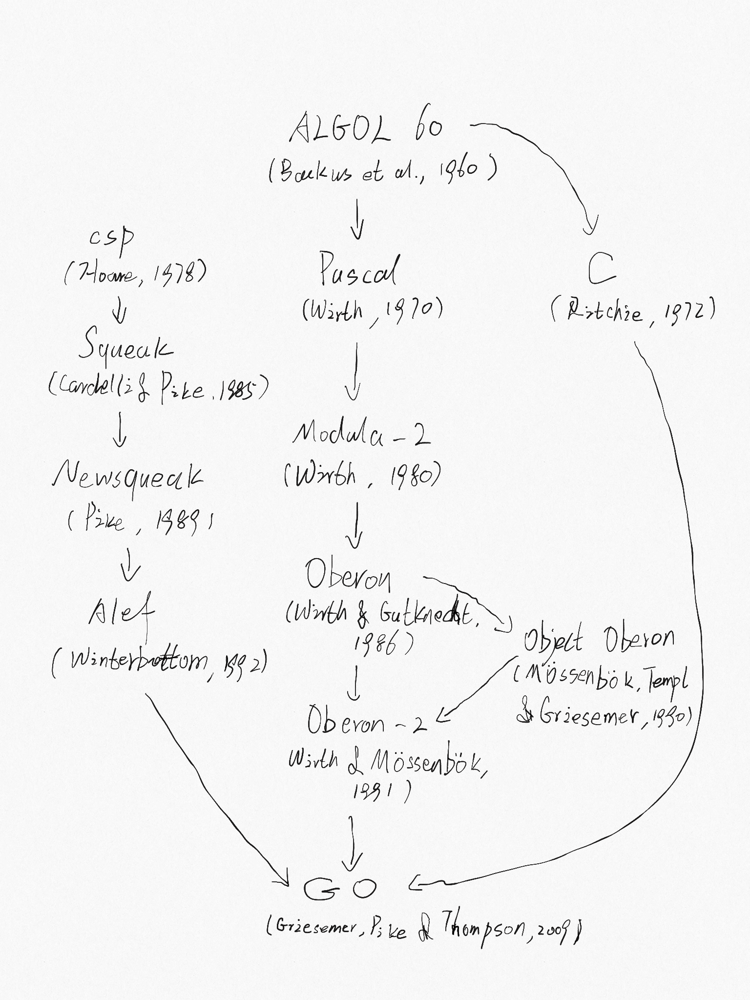

# 前言

“Go是一种开放源代码的程序设计语言，它意在使得人们能够方便的构建简单、可靠、高效的软件。”（来自Go官网golang.org）

Go形成构思是在2007年9月，并与2009年11月发布，其发明人是Robert Griesemer、Rob Pike 和Ken Thompson，这几位都任职于Google。该语言及其配套工具集意在使得编译和执行都能够富有表达力和效率，而且使得程序员能够轻松写出可靠、健壮的程序。

Go和C从表面上看起来相似，而且和C一样，它也是一种专业程序员使用的工具，兼有事半功倍之效。但是Go远不止是C的一种升级版本。它从多种其他语言中借用和改造了不少好的思想，还避开了那些导致复杂和脆弱的语言特性。它为并发提供的设施是全新的、高效的，它实现数据抽象和面向对象的途径是其及其灵活的。它还提供了自动化的内存管理，或称为`垃圾回收`。

Go特别适合构建基础设施类软件（如网络服务器），以及程序员使用的工具和系统等。但它的的确确是一种通用的语言，而且在诸多领域（如图像处理、移动应用、机器学习）中都能发现它的身影。它在很多场合下被用于替换无类型的脚本语言，这是由于它平衡了表达力和安全性：Go程序通常比动态语言程序运行速度要快，遭遇意料之外的类型错误而导致的崩溃更是少的多。

Go是个开源的项目，所以其编译器、库和工具的源代码是所有人皆可免费取得的。来自全世界的社区都在积极的向这个项目贡献代码。Go的运行环境包括类UNIX系统--Linux、FreeBSD、OpenBSD和Mac OS X，还有Plan9和Microsoft Windows。只要在这些环境之一中写了一个程序，基本上不加修改就可以运行在其他环境中。

本书旨在帮助你立刻开始使用Go，以及良好的掌握这门语言，充分利用Go的语言特性和标准库来撰写清晰的、符合习惯用法的、高效的程序。

## Go的起源

和生物学物种一样，成功的语言会繁衍后代，这些后代语言会从他们的祖先那里汲取各种优点；有时候，语言间的混血会产生异常强大的力量；在一些罕见的情况下，某个重大的语言特性也可能凭空出现而并无先例。通过考察语言间的影响，我们可以学得不少知识，比如语言为什么会变成这个样子，以及它适配过哪些语言环境，等等。

下图展示课更早出现的程序设计语言对Go产生的最重要的影响。



Go有时会被称为“类C语言”或“21世纪的C”。从C中，Go继承了表达式语法、控制流语句、基本数据类型，按值调用的形参传递、指针，但比这更重要的是，集成了C所强调的程序要编译成高效的机器码，并自然地与所处的操作系统提供的抽象机制相配合。

可是，Go的家谱中还有其他的祖先。产生主要的影响的是来自Niklaus Wirth设计的、以Pascal为发端的一个语言支流。Modula-2启发了包的概念。Oberon消除了模块接口文件和模块实现文件的区隔。Oberon-2影响了包、倒入和声明语法。Object Oberon则提供了方法声明语法。

另一只Go的世系祖先，也是使得Go相对于的程序设计显的卓然不群者，是一族名不见经传的，在贝尔实验室开发的研究的语言。这些语言受到了Tony Hoare于1978年发表的关于并发性基础的开创性论文所提出的`通信顺序进程`（Communicating Sequential Process，CSP）的启发。在CSP中程序就是一组无共享状态进程的并行组合,进程间的通信和同步采用信道完成。不过，Hoare提出的CSP是一种形式语言，仅用以描述并发性的基本概念，并不是一种用来撰写可执行程序的程序设计语言。

Rob Pike 等人开始动手做一些实验，尝试把CSP实现为真正的语言。第一中这样的语言称为Squeak（“和鼠类沟通的语言”），它是一种用以处理鼠标和键盘事件的语言。紧接着它的是Newsqueak，它带来的是类C的语句和表达式语法，以及类Pascal的类型记法。它是一种纯粹的函数式语言，带有垃圾收集，同样也可以管理键盘、鼠标和窗口事件为目标。信道成了一等值（first-class value），它可以动态创建并采用变量存储。

Plan9操作系统将这些思想都纳入了一种称为Alef的语言。Alef尝试将Newsqueak改造成一种可用的操作系统级程序设计语言，但垃圾收集的缺失使得它在处理并发性时太过痛苦了。

Go中的其他结构也会在这里或那里显示出并非来自祖先的基因。例如，iota多多少少有点APL的影子，而嵌套函数的词法作用域则来自Scheme（以及由之而来的大部分语言）。在Go语言中，也可以发现全新的变异。Go的创新性的切片为动态数组提供了高效的随机访问的同时，也允许旧式链表的复杂共享机制。还有，defer语句也是Go中新引入的。

## Go项目

所有的程序设计语言都反映了其发明者的程序设计哲学，这其中往往有相当大的一部分是对于此前的语言已知缺点的应对措施。Go这个项目也是诞生与挫败感之中的，这中挫败感来源于Google的若干遭遇了复杂性爆炸性增长的软件系统。（而这个问题绝非Google所独有的。）

“复杂性是以乘积方式增长的。”Rob Pike如是说，为了修复某个问题，一点点地将系统的某个部分变的更加复杂，这不可避免地也给其他部分增加了复杂性。在不断要求增加系统功能和选项以及配置，还要快速发布的压力之下，简单性往往忽略了----尽管长期来看，简单性才是好软件的不二法门。

要实现简单性，就要求项目的一开始就将思想浓缩至本质，并在项目的整个生命周期多保持一些自律，认识到哪些变化是好的，哪些是坏的或者是致命的。只要投入足够的努力，好的变化就可以实现目的，又能够不损害软件设计上的Fred Brooks所谓的“概念完整性”。坏的变化就做不到这一点，而致命的变化则会牺牲“简单性”而去换得其浅薄的兄弟概念----“方便性”。但是之后通过设计上的简单性，系统才能在增长过程中保持稳定、安全和自洽。

Go项目不仅仅包括语言本身、它的工具和标准库，还有决不能忽视的一点，就是它保持极端简单性的行为文化。在高级语言中，Go出现的较晚，因而有一定的后发优势，它的基础部分实现的不错：有垃圾收集、包系统、一等函数、词法作用域、系统调用接口，还有不可变的、默认用UTF-8编码的字符串。但相对来说，它的语言特性不多，而且不太会增加新特性了。比如说，它没有隐式数值类型强制转换，没有构造或析构函数，没有运算符重载，没有形参默认值。没有继承，没有范型，没有异常，没有宏，没有函数注记，没有线程局部存储。这门语言成熟而稳定，并且保证兼容更早版本：在旧版本写的Go语言程序，可以在新版本的编译器和标准库下编译和运行。

Go的类型系统足可以使程序员避免在动态语言中会无意犯下的绝大多数错误，但相对而言，它在带类型的语言中又算是类型系统比较简单的。其实现手法有时候会导致类型框架林立却彼此孤立的“无类型”程序设计风格，并且Go程序员不会在类型方面走到C++或Haskell程序员的那一步----重度地表达类型安全性作为语言具备类型基础的证据。但在实际工作中，Go却能为程序员提供具备相当强类型的系统才能实现的安全性和运行时性能，而不让程序员承担这种系统的复杂性。

Go提倡充分利用当代计算机系统设计，尤其强调局部性的重要。其内建数据类型和大多数据库数据结构都经过仔细设计，力求以自然方式工作，而不要求显式的初始化或隐式的构造函数。这么一来，隐藏在代码中的内存分配和内存写入就大大减少了。Go中的聚合类型（结构体和数组）都是以直接方式持有元素，需要更少的存储以及比使用间接域的语言还少的分配动作和间接指针。由于现代计算机都是并行工作的，正如前面提到的那样，Go有着基于CSP的并行特性。Go还提供了变长栈来运行其轻量级线程，或称为goroutine。这个栈初始化时非常小，所以创建一个goroutine的成本极低，创建100万个也完全可以接受。

Go标准库常常被称作“语言自带电池”，它提供了清晰的构件，以及用于I/O、文件处理、图像、加解密、网络、分布式应用的API，而且对许多标准文件格式和协议都提供了支持。Go的库和工具充分地尊重惯例，减少了配置和解释的需要，从而简化了程序的逻辑，提高了多种多样的Go程序之间的相似性，使得它更容易学习和掌握。采用go工具构建的项目，仅使用文件和标识符的名字（在极少情况下使用特殊注释），就可以推断出一个项目使用的所有库、可执行文件、测试、性能基准、示例、平台相关变体，以及文档。Go的源代码中就包含了构建的规格说明。

## 全书组织

我们假定你用过一两种其他语言编写程序，可能是像C、C++或Java那样的编译型语言，也可能像Python、Ruby或JavaScript那样的解释型语言，所以我们不会像对一个没有任何基础的初学者那样事无巨细的讲述所有的事。表面上的语法大体雷同，变量、常量、表达式、控制流和函数也一样。

第一章是Go的基础结构的综述，通过十几个完成日常任务（包括读写问价、格式化文本、创建图像，以及在Internet客户端和服务器之间通信）的程序来介绍这门语言。

第2章是讲述Go程序的组成元素----声明、变量、新类型、包和文件，以及作用域。第3章讨论数值、布尔量、字符串、常量，还解释如何处理Unicode。第4章描述组合类型，即使用简单类型构造的类型，形式有数组、键值对、结构体，还有切片这种Go中动态链表的实现。第5章的内容是函数，另外还讨论了错误的处理、崩溃和恢复，以及defer语句。

可以看出，第1章到第5章是基础性的，其内容是任何命令式语言都有的。Go的语法和风格可能与其他语言有所不同，但大多数程序员都能很快的掌握。余下的章节所关注的则是Go语言中与惯常做法有一定区别的内容，包括方法、接口、并发、包、测试和反射。

Go以一种不同寻常的方式来诠释面向对象程序设计。它没有继承，甚至没有类。较复杂的对象行为是通过较简单的对象组合而非继承完成的。方法可以关联到任何用户自定义的类型，而不一定是结构体。具体类型和抽象类型（即接口）之间的关系是隐式的，所以一个具体类型可能会满足该类型设计者没有意识到其存在的接口。方法在第6章讲述，接口在第7章讲述。

第8章内容是Go的并发性处理途径，它基于CSP思想，采用Goroutine和信道实现。第9章则讨论并发性中较传统的基于共享变量的一些方面的话题。

第10章讨论包，也就是组织库的机制。本章也说明如何高效地利用go工具，仅仅这个工具，就提供了编译、测试、性能基准测定、程序格式化、文档，以及完成许多其他任务的功能。

第11章讨论测试，在这里Go采用了显著的轻量级途径，避免了重重抽象的框架，转而使用简单的库和工具。测试库提供了一个基础，在其之上如有必要就可以构建更复杂的抽象了。

第12章讨论反射，即程序在执行期间考察自身表示的能力。反射是一种强大的工具，不过得小心使用它，本章通过演示如何用它来实现某些重要的Go库，解释了如何找到适当的平衡。第13章解释低阶程序设计的细节，运用unsafe包来绕过Go的类型系统，以及什么时候这样做是合适的。

每章都配以一定数量的练习，你可以用来测试对Go的理解，或是探索对书中示例的扩展和变形。

除了最简单的那些以外，所有书中的示例都可以从位于gopl.io的公开的Git仓库下载。每个示例由其包的导入路径识别，从而能够方便地使用go get命令获取，构建和安装。你需要选取一个目录作为你的Go工作空间，并将GOPATH环境变量指向之。在必要时，go工具会创建该目录。例如：

```sh
    $ export GOPATH=$HOME/gobook
    $ go get gopl.io/ch1/helloworld
    $ $GOPATH/bin/helloworld
    Hello, 世界
    欲运行这些例子，你至少需要1.5版本的Go语言。
    $go version
    go version go1.5 linux/amd64
```

如果你的计算机上go工具太旧或是缺失，请按https://golang.org/doc/install 的指令操作。

## 更多信息来源

关于Go的更多信息，最好的来源就是Go的官方网站: https://golang.org ,它上面列出了文档供读者访问，包括Go程序设计语言的规范、标准包，诸如此类。它上面还列出语言综述，指导如何撰写Go程序，以及如何撰写好的Go程序，还有范围广泛的在线文本和视频资源，这些都是对本书有价值的补充。位于blog.golang.org的Go博客发表的是关于Go的最好文章，以及该语言当下状态、未来计划、会议报告，还有范围广泛的Go相关话题的深度解读。

Go官网在线访问的一个最有用的方面（这也是纸质书的一个令人遗憾的限制），就是它提供了从描述Go程序的网页上直接运行Go程序能力。这种功能由位于play.golang.org的Go的训练场提供，也有嵌入其他页面的，比如位于golang.org的首页，或是由godoc工具提供的文档页面。

训练场为执行简单的实验，撰写短小的程序来检验自己对语法、语义和库包的理解提供了方便，它在很多方面取代了其他语言中的读取-求值-输出循环（rad-Eval-Print Loop, REPL）。它的永久URL对于共享使用Go写成的小段代码、报告缺陷或提出建议都是很有用的。

在训练场的基础之上，位于tour.golang.org的Go综述就是一系列的小型交互式课程，内容是Go语言的基础思想和结构，是整门语言的有序攻略。

训练场和综述的主要缺点在于它只允许导入标准库，还有很多库特性（比如网络库）都出于可操作性或安全原因加以限制了。而要编译和运行每个程序，都要求Internet连接。所以，欲进行更详尽的实验，需要在本机上运行Go程序。幸运的是，下载过程相当的直接了当，从golang.org获取Go的分发程序并开始撰写和运行你自己的Go程序，用不了几分种。

由于Go是个开源项目，你可以从https://golang.org/pkg 上在线读取标准库中的任何类型或函数代码，每个供下载的分发都同样包含这些代码。请使用这些代码来弄明白某些程序运行原理、回答关于程序细节的问题，也可以用他们来学一学专家是如何写出一流的Go代码的。

## 致谢

来自Go团队的核心成员Rob Pike和Russ Cox仔细通读了初稿数次，他们对于从词句的斟酌到整体结构和组织的建议都极富的价值。在准备本书的日语版时，柴田芳树所做的贡献大大超过了他负担的义务，他的火眼金睛发现了大量英文书本中的不一致性，以及代码中的错误。我们向Brian Goetz、Corey Kosak、Arnold Robbins、Josh Bleecher Snyder以及Peter Weinberger对全书初稿所进行的彻底审查和批评建议深表敬意。

我们感激Sameer Ajmani、Ittai Balaban、David Crawshaw、Billy Donohue、Jonathan Feinberg、Andrew Gerrand、Robert Griesemer、John Linderman、Minux Ma、Bryan Mills、Bala Natarajan、Cosmos Nicolaou、Paul Staniforth、Nigel Tao以及Howard Trickey提供的诸多有用的建议。我们也感谢David Brailsford和Raph Levien的排版建议。

我们的Addison-Wesley编辑Greg Doench最初催生了本书，而且一直不断地给予了帮助。Addison-Wesley的制作团队----John Fuller、Dayna Isley、Julie Nahil、Chuti Prasertsith以及Barbara Wood----非常杰出，作者得到了一流的支持。

Alan Donovan想要感谢Google的Sameer Ajmani、Chris Demetriou、Walt Drummond以及Reid Tatge让他有时间来写作这本书，还有Stephen Donovan的建议和及时的鼓励。最重要的四他的妻子Leila Kazemi，她为写作项目提供了毫不犹豫的热情和毫不动摇的支持，即使写作造成了很多家庭生活的分心和缺席。

Brian Kernighan对他的朋友和同事深表感谢，他们对Kernighan花费了很长时间才达成对语言的理解表示了耐心和理解。尤其是他的妻子Meg，她为Kernighan的写作以及太多的其他事物提供了不间断的支持。

                                                                                                                          纽约
                                                                                                                    2015年10月
